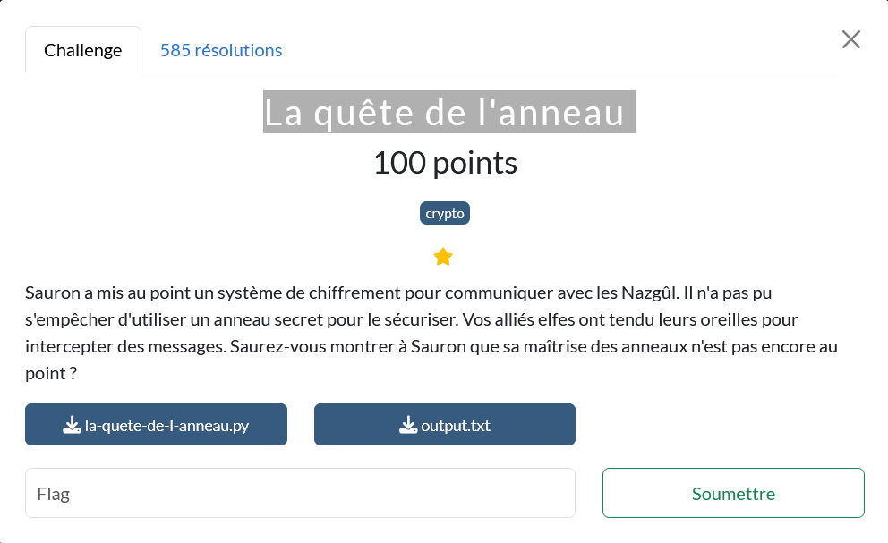
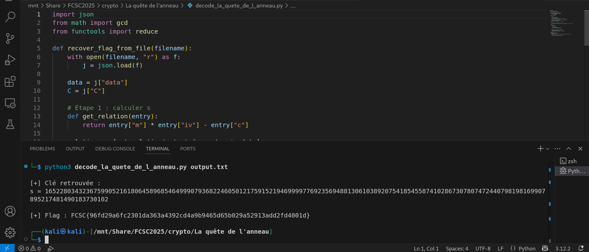

# SUJET



# Principe

Le script Python la-quete-de-l-anneau.py implémente un chiffrement basé sur une multiplication modulaire avec une clé secrète s, construite comme :

```python
self.s = 2**size + randrange(2**size)

Par défaut, size = 512, donc s ≈ 2**512 est une clé de 1024 bits, ce qui n'est pas faible en soi. Mais si la taille de clé a été réduite (par exemple à size = 32 ou 64), alors l'espace de recherche pour s devient exploitable.

## Structure de ce chiffrement
Pour chaque bloc b de message :

Un iv aléatoire est généré (premier avec s)

Le chiffrement est c = b * iv mod s

Et pour déchiffrer :

On utilise m = c * iv⁻¹ mod s

* Objectif : retrouver flag à partir de C
Il y a en sortie deux objets JSON :

"data" contient plusieurs triplets (m, iv, c) — donc on connaît tous les éléments !

"C" contient juste des (iv, c) chiffrés du flag.

- Étape 1 : retrouver s
Pour chaque bloc (m, iv, c) connu :

## Chiffrement et Déchiffrement

### Chiffrement
## 1. Comprendre le chiffrement

Le chiffrement s'effectue bloc par bloc selon la formule :

c = m * iv mod s


- `m` : le bloc du message (entier)
- `iv` : un entier aléatoire tel que `gcd(iv, s) = 1`
- `s` : la clé secrète (grand entier)
- `c` : le bloc chiffré
---

### Déchiffrement

Pour déchiffrer chaque bloc, on utilise l'inverse modulaire de `iv` :

m = c * iv⁻¹ mod s

- `iv⁻¹` : l'inverse modulaire de `iv` modulo `s`, tel que `iv * iv⁻¹ ≡ 1 (mod s)`
- `m` : bloc déchiffré (entier original)
---

Ces opérations permettent de chiffrer et déchiffrer de manière symétrique à condition de connaître `s`.
## 2. Utilisation des blocs `(m, iv, c)` dans `data`

Le script génère une liste de blocs contenant :

- `m` : le message clair (sous forme d'entier)
- `iv` : un nombre aléatoire premier avec `s`
- `c` : le message chiffré

Chaque triplet suit la relation :

c = m * iv mod s

Ce qui implique :

m * iv - c ≡ 0 mod s

Autrement dit, pour chaque bloc connu, on peut écrire :

s | (m * iv - c)

Donc `s` divise chacun des termes :

m₁ * iv₁ - c₁,
m₂ * iv₂ - c₂,
...
mₙ * ivₙ - cₙ

On en déduit que :

s = gcd(m₁ * iv₁ - c₁, m₂ * iv₂ - c₂, ..., mₙ * ivₙ - cₙ)
---

## 3. Récupérer `s` avec le PGCD

On récupère la clé secrète `s` en calculant le PGCD de tous les termes `(m * iv - c)` à partir des blocs du champ `data`.
---

## 4. Déchiffrer `C`

Une fois `s` retrouvé, on peut déchiffrer chaque bloc du tableau `C` avec la formule :


- Étape 2 : déchiffrer le flag
Une fois s retrouvé, il peut s'appliquer l'inversion modulaire sur iv et se calculer :

m = c * iv⁻¹ mod s
m = c * pow(iv, -1, s) % s

où `iv⁻¹` est l'inverse modulaire de `iv` modulo `s`.

Ensuite, on convertit chaque `m` en bytes, on les concatène, et on devra obtenir le flag .

L'extraction de s et déchiffrement du flag se codent à partir d’exécution du script (JSON).



# Script : decode_la_quete_de_l_anneau

[Voir le code source](src/decode_la_quete_de_l_anneau.py)
