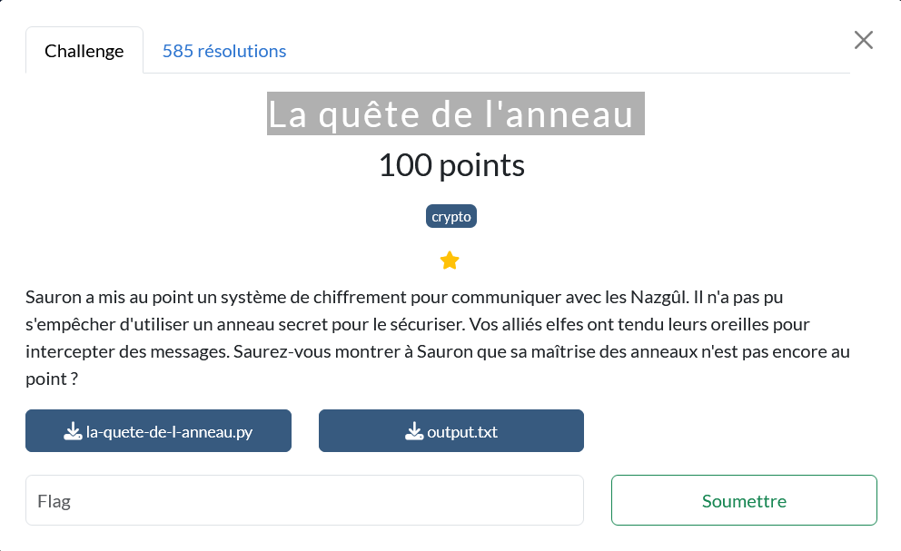
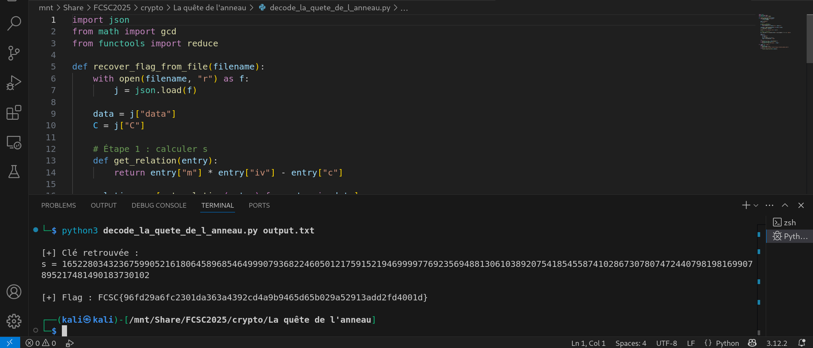

# La revanche de Sauron
## La quête de l’anneau (FCSC 2025 — Crypto — 100 pts)

Ce défi de cryptographie (FCSC 2025) a été construit autour d’un schéma de chiffrement volontairement fragile : chaque bloc du message est chiffré par une simple multiplication modulaire c = (m·iv) mod s, avec un secret s (l’“anneau”) et un aléa iv inversible. Comme le fichier fourni contient plusieurs exemples de clair connu (m, iv, c), on peut remonter à s en calculant le PGCD des valeurs m·iv − c, puis déchiffrer le flag en appliquant l’inverse modulaire de iv sur les blocs chiffrés.




---

## Objectif du challenge

Retrouver le **flag au format `FCSC{...}`** à partir d’un fichier JSON (`output.txt`) contenant :
- des triplets de **clair connu** `(m, iv, c)` (section `data`) ;
- les couples `(iv, c)` correspondant au **flag chiffré** (section `C`).

---

## Méthodologie de résolution

1. **Modéliser le chiffrement** : le challenge chiffre chaque bloc par une simple multiplication modulaire  
   `c = (m * iv) mod s` avec une clé secrète `s` et un `iv` inversible modulo `s`.
2. **Exploiter le clair connu** : pour chaque triplet connu `(m, iv, c)`, on a  
   `m*iv - c ≡ 0 (mod s)` donc `s | (m*iv - c)`.
3. **Retrouver la clé `s`** : calculer le **PGCD** sur plusieurs valeurs `m_i*iv_i - c_i` pour converger vers `s`.
4. **Déchiffrer le flag** : pour chaque bloc de `C`, calculer  
   `m = c * iv^{-1} mod s` (inverse modulaire), puis reconstruire la chaîne du flag (bloc(s) de 64 octets).
5. **Vérifier** : le résultat doit être une chaîne ASCII lisible au format `FCSC{...}`.

---

## Table des matières

1. [Contexte](#1-contexte)
2. [Fichiers](#2-fichiers)
3. [Principe du chiffrement](#3-principe-du-chiffrement)
4. [Vulnérabilité et idée d’attaque](#4-vulnérabilité-et-idée-dattaque)
5. [Déchiffrement du flag](#5-déchiffrement-du-flag)
6. [Exécution et résultat](#6-exécution-et-résultat)
7. [Code source intégré](#7-code-source-intégré)
   - [7.1 Solveur — `decode_la_quete_de_l_anneau.py`](#71-solveur--decode_la_quete_de_l_anneaupy)
   - [7.2 Script challenge — `la-quete-de-l-anneau.py`](#72-script-challenge--la-quete-de-l-anneaupy)
8. [Notes et pièges](#8-notes-et-pièges)
9. [Annexe — capture d’exécution](#9-annexe--capture-dexécution)

---

## 1. Contexte

Challenge **crypto** du **FCSC 2025** : Sauron chiffre ses messages avec un “anneau secret”.
Vos alliés interceptent :

- des données de **clair connu** (liste `data`) ;
- puis les blocs chiffrés du **flag** (liste `C`).

Le tout est fourni dans un JSON (`output.txt`).

---

## 2. Fichiers

- `la-quete-de-l-anneau.py` : script d’énoncé (génération + chiffrement)
- `output.txt` : données interceptées (JSON avec `data` et `C`)
- `decode_la_quete_de_l_anneau.py` : solveur (récupération de la clé `s` puis déchiffrement)

Arborescence recommandée pour le rendu GitHub :

```
.
├── writeup.md
├── la-quete-de-l-anneau.py
├── decode_la_quete_de_l_anneau.py
├── output.txt
└── img/
    ├── la_quete_de_l_anneau.png
    ├── sauron_la_quete_illustree.png
    └── vs_qda.png
```

---

## 3. Principe du chiffrement

Le chiffrement est **bloc-par-bloc** et repose sur une multiplication modulaire avec une clé secrète `s`.

Paramètres (par défaut dans le challenge) :

- `size = 512`
- `bs = size // 8 = 64` octets par bloc
- clé secrète :
  - `s = 2**size + randrange(2**size)` (donc `s` est un entier proche de `2^512`)

Pour chaque bloc clair `m` (interprété comme un entier) :

1. on tire un `iv` aléatoire tel que `gcd(iv, s) = 1` (donc inversible modulo `s`)
2. on calcule le chiffré :
   - **`c = (m * iv) mod s`**

Le JSON contient :

- `data`: des triplets **connus** `(m, iv, c)` (clair connu)
- `C`: des couples `(iv, c)` correspondant au flag (clair inconnu)

---

## 4. Vulnérabilité et idée d’attaque

Sur un triplet connu `(m, iv, c)` :

`c ≡ m * iv (mod s)`

Donc :

`m*iv - c ≡ 0 (mod s)`  
ce qui signifie :

**`s | (m*iv - c)`**

Autrement dit, chaque valeur :

`r_i = m_i * iv_i - c_i`

est un multiple de `s`. En prenant le **PGCD** sur plusieurs échantillons, on récupère `s` :

**`s = gcd(r_1, r_2, ..., r_n)`**

---

## 5. Déchiffrement du flag

Une fois `s` retrouvé, on déchiffre chaque bloc de `C` :

- `m = c * iv^{-1} mod s`

En Python :

- `iv_inv = pow(iv, -1, s)`
- `m = (c * iv_inv) % s`

Puis on reconstruit le message en convertissant chaque `m` en `bs` octets et en concaténant.

---

## 6. Exécution et résultat

Commande :

```bash
python3 decode_la_quete_de_l_anneau.py output.txt
```

Sortie (sur les fichiers fournis) :

```text
[+] Clé retrouvée :
s =
16522803432367599052161806458968546499907936822460
50121759152194699997769235694881306103892075418545
58741028673078074724407981981699078952174814901837
30102

[+] Flag : FCSC{96fd29a6fc2301da363a4392cd4a9b9465d65b029a52913add2fd4001d}
```

Flag (rappel) :

`FCSC{96fd29a6fc2301da363a4392cd4a9b9465d65b029a52913add2fd4001d}`

---

## 7. Code source intégré

### 7.1 Solveur — `decode_la_quete_de_l_anneau.py`

Objectif :

1) récupérer `s` via `gcd(m*iv - c)` sur `data`  
2) déchiffrer la liste `C` via l’inverse modulaire

```python
#!/usr/bin/env python3
import json
from math import gcd
from functools import reduce


# Récupère la clé secrète s en prenant le PGCD des relations (m*iv - c) issues du clair connu.
def recover_s_from_known_plaintexts(data: list[dict]) -> int:
    """
    Calcule la clé secrète s à partir de données de clair connu.
    Chaque entrée fournit (m, iv, c) et on sait que:
        c ≡ m*iv (mod s)  =>  s | (m*iv - c)
    Donc s est le PGCD des (m*iv - c).
    """
    relations = [abs(entry["m"] * entry["iv"] - entry["c"]) for entry in data]
    return reduce(gcd, relations)


# Déchiffre la liste C de blocs (iv, c) en appliquant m = c * iv^{-1} mod s et reconstruit le message.
def decrypt_blocks(C: list[dict], s: int, bs: int) -> bytes:
    """
    Déchiffre les blocs de C (liste de {iv, c}) :
        m = c * iv^{-1} mod s
    et reconstruit le message en concaténant m sur bs octets.
    """
    out = b""
    for d in C:
        iv = d["iv"]
        c = d["c"]
        m = (c * pow(iv, -1, s)) % s
        out += m.to_bytes(bs, "big")
    return out


# Point d’entrée du solveur : charge le JSON, calcule s, déchiffre C, puis affiche le flag.
def main(path: str) -> None:
    with open(path, "r", encoding="utf-8") as f:
        j = json.load(f)

    data = j["data"]
    C = j["C"]

    # 1) Récupération de s
    s = recover_s_from_known_plaintexts(data)

    # Affichage "lisible" de s sur plusieurs lignes
    s_str = str(s)
    print("[+] Clé retrouvée :")
    print("s =")
    for i in range(0, len(s_str), 50):
        print(s_str[i:i+50])
    print()

    # 2) Paramètres du challenge (par défaut size=512 => bs=64)
    bs = 64

    # 3) Déchiffrement
    flag_bytes = decrypt_blocks(C, s, bs)

    try:
        print(f"[+] Flag : {flag_bytes.decode()}")
    except UnicodeDecodeError:
        print(f"[+] Flag (raw bytes) : {flag_bytes!r}")


if __name__ == "__main__":
    import sys

    if len(sys.argv) != 2:
        print(f"Usage: {sys.argv[0]} <output.txt>")
        raise SystemExit(1)

    main(sys.argv[1])
```

---

### 7.2 Script challenge — `la-quete-de-l-anneau.py`

Ce script montre comment `s`, `iv` et `c` sont générés et pourquoi `iv` est inversible modulo `s`.

```python
#!/usr/bin/env python3

import json
import os
from Crypto.Util.number import bytes_to_long, long_to_bytes
from random import randrange
from math import gcd

FLAG = os.getenv("FLAG", "FCSC{THIS_IS_A_FAKE_FLAG}").encode()

class Cipher:
	# Initialise le chiffreur avec une clé secrète s proche de 2^size et la taille de bloc associée.
	def __init__(self, size):
		self.s = 2**size + randrange(2**size)
		self.size = size

	# Chiffre un bloc : choisit iv inversible mod s, puis calcule c = (m*iv) mod s.
	def encrypt(self, m):
		assert len(m) <= self.size//8

		m = bytes_to_long(m)

		iv = randrange(self.s)
		while gcd(iv, self.s) != 1:
			iv = randrange(self.s)

		c = m * iv % self.s
		return (iv, c)

	# Déchiffre un bloc : applique m = c * iv^{-1} mod s puis convertit en bytes.
	def decrypt(self, iv, c):
		m = c * pow(iv, -1, self.s) % self.s
		return long_to_bytes(m)

	# Chiffre un message complet en le découpant en blocs bs=size//8, en chiffrant chaque bloc.
	def encrypt_message(self, m):
		bs = self.size//8
		assert len(m) % bs == 0, f"Message should have length multiple of {bs} (has {len(m)})"
		C = []
		for i in range(0, len(m), bs):
			C.append(self.encrypt(m[i:i+bs]))
		return C

# Génère des données de clair connu (data) puis chiffre le flag bloc-par-bloc et imprime un JSON.
def main():
	size = 512
	cipher = Cipher(size)

	data = []
	for _ in range(40):
		m = os.urandom(size//8)
		iv, c = cipher.encrypt(m)
		data.append({"m": bytes_to_long(m), "iv": iv, "c": c})

	# Le flag est chiffré bloc par bloc (64 octets)
	C = cipher.encrypt_message(FLAG)

	print(json.dumps({
		"data": data,
		"C": [{"iv": iv, "c": c} for (iv, c) in C]
	}))

if __name__ == "__main__":
	main()
```

---

## 8. Notes et pièges

- **Pourquoi `gcd(iv, s)=1` est crucial ?**  
  Parce que le déchiffrement nécessite `iv^{-1} mod s`. Si `iv` n’était pas inversible, `pow(iv, -1, s)` échouerait.

- **Pourquoi le PGCD “retombe” sur `s` ?**  
  Chaque relation `m*iv - c` est un multiple de `s`. Le PGCD de plusieurs multiples indépendants converge vers le facteur commun maximal, ici `s`.

- **Pourquoi `bs=64` dans le solveur ?**  
  Dans le challenge, `size=512`, donc `bs=size//8=64`. Le flag fait exactement 64 octets (un seul bloc) dans l’instance fournie.

---

## 9. Annexe — capture d’exécution


