# SUJET
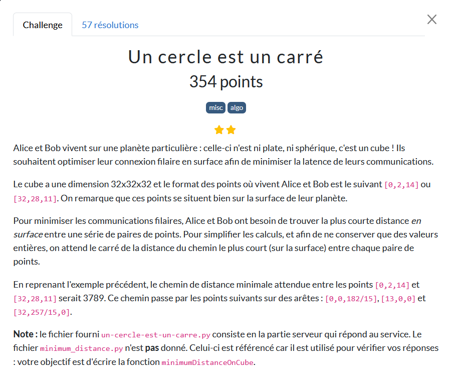

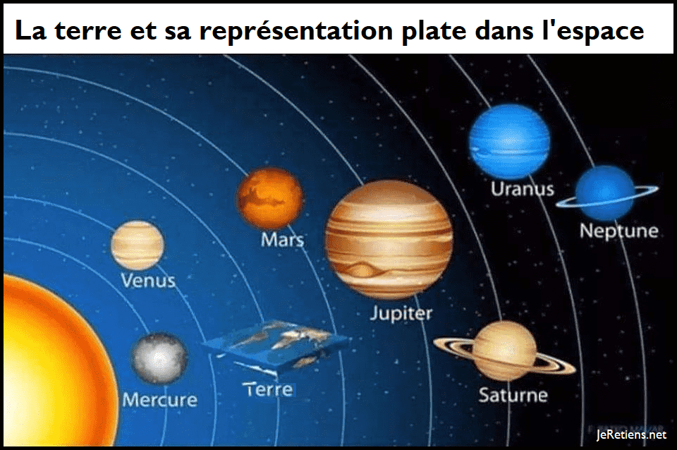

# Principe

Différentes configurations des points sont représentées sur le cube figurant à la suite. A : Alice ; B : Bob

Les différents cas  pour A et B :

Considérons les différents cas de figures.

## détecter les faces
on nomme les faces par rapport a x constant et vaut 0 : x0, x constant et vaut 1 longueur 32 : x1 etc..

```python
def list_faces(p: Tuple[int, int, int]):
    l = []
    x, y, z = p
    if x == 0:
        l.append('x0')
    if x == CUBE_SIZE:
        l.append( 'x1')
    if y == 0:
        l.append( 'y0')
    if y == CUBE_SIZE:
        l.append( 'y1')
    if z == 0:
        l.append( 'z0')
    if z == CUBE_SIZE:
        l.append( 'z1')
    return l

```
## Cas 1
 A et B Xsont sur la même face du cube. Le plus court chemin est la ligne droite entre les deux points. La fonction de la distance au carré correspond à appliquer Pythagore dans un espace à 3D.
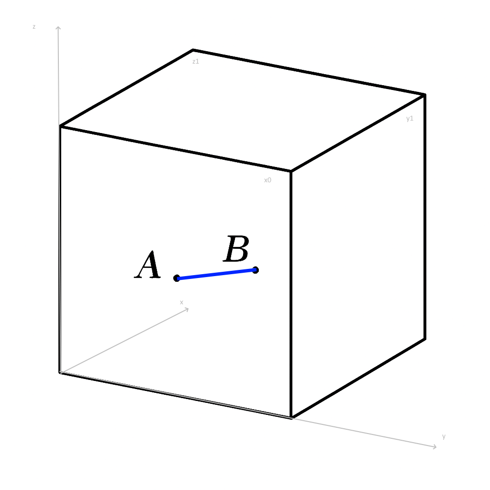
### calcul cas1
La fonction d2_same_face(A,B) : teste au moins une coordonnée x, y ou z idem : la différence vaut 0.
La fonction def list_faces (p) : établit la liste des faces sur lesquelles se trouve le point (entre 1 et 3).

```python
def d2_same_face(A, B):
    # la coordonnée commune vaut 0 ou 32, donc la différence est nulle
    return (A[0] - B[0])**2 + (A[1] - B[1])**2 + (A[2] - B[2])**2
```

Dans le cas le plus fréquent, un point est sur une face, plus rarement sur deux et très rarement sur 3.
X0 désigne, conventionnellement, la face devant nous et X1 désigne la face arrière en X=32, Y=0, Z=0.


## Cas 2
 c’est la situation la plus fréquente. A et B ne sont pas sur la même face, mais ils sont sur des faces adjacentes. Il n’y a pas de calcul de distance directe ; car il s’agit d’aller d’abord à la face de l’arête : de A jusqu’au point I puis de I jusqu’à B ; I étant sur l’arête tel que distance(A,I) + distance(I,B) est minimale.


Pour le calcul du cas 2 et des suivants : voir ci apres le mode de calcul

Les autres cas à considérer sont
## Cas 3
A et B sont sur des daces adjacentes mais en changeant de face pour aller de A à B en passant par une face commune évidente ; distance (A,B) = distance (A, I1) + distance(I1, I2) + distance (I2,B).
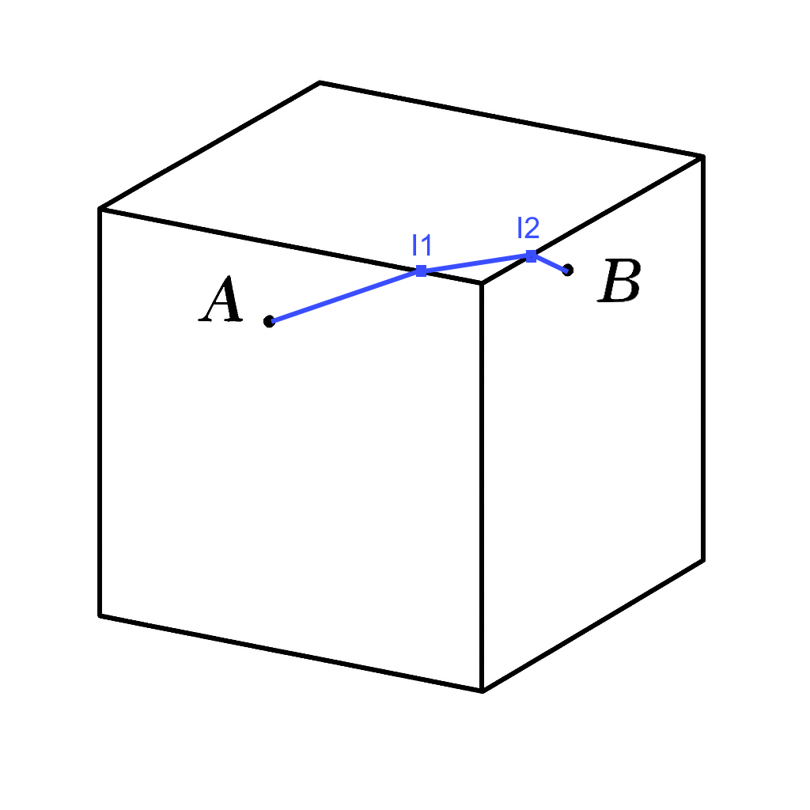

## Cas 4
A et B sont sur des faces opposées (suite du cas 3) avec I1 et I2 obligatoires en face intermédiaire.
Il s’agit donc de trouver I1 et I2 tels que : AI1+ I1I2 + I2B soit minimum avec les deux faces opposées.
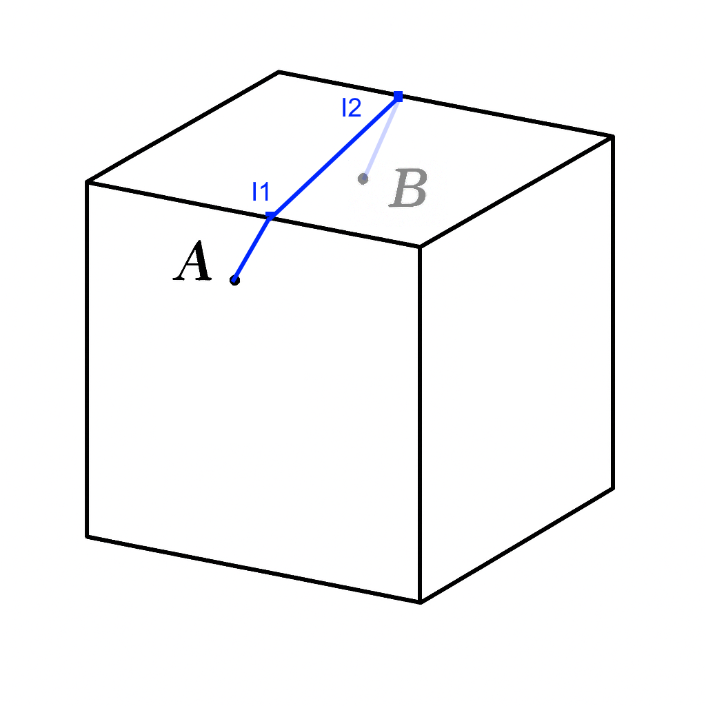

## Cas 5
le chemin le plus court passe par deux faces intermédiaires : il y a à changer deux fois de faces si B est proche d’un bord. Il y a 3 points intermédiaires I1, I2, I3 tels que AI1+I1I2+I2I3+I3B est minimal.
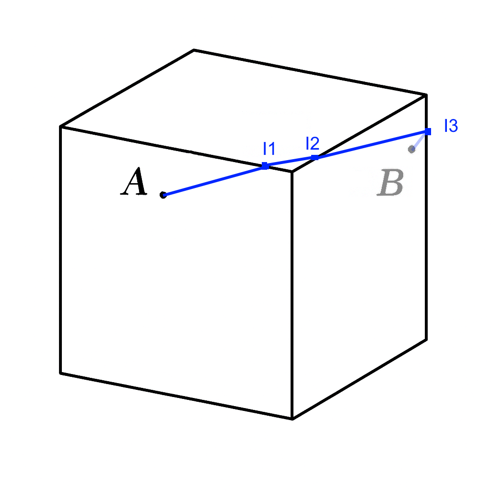

# Le calcul hors du cas1 trivial précédent
Les calculs doivent minimaliser les distances.

Le choix est celui d’une recherche en « semi brute force » au lieu de projection et rotation dans le plan 

(voir projection mathématique en annexe à la fin : Le premier algorithme n’a pas abouti ; bien qu’ayant fonctionné sur un bon nombre des cas, successifs).

Le script correspondant à la résolution simple : carre_brute.py est plus informatique que mathématique.

Avec la face de A et B, I est trouvé sur le bord ; chaque segment est découpé en 32 unités depuis I à A et la découpe est pareille pour I de B ce qui donne deux tableaux de points se recoupant partiellement.
  ```python
  def points_I_detail(A, I, face_A):
  ```
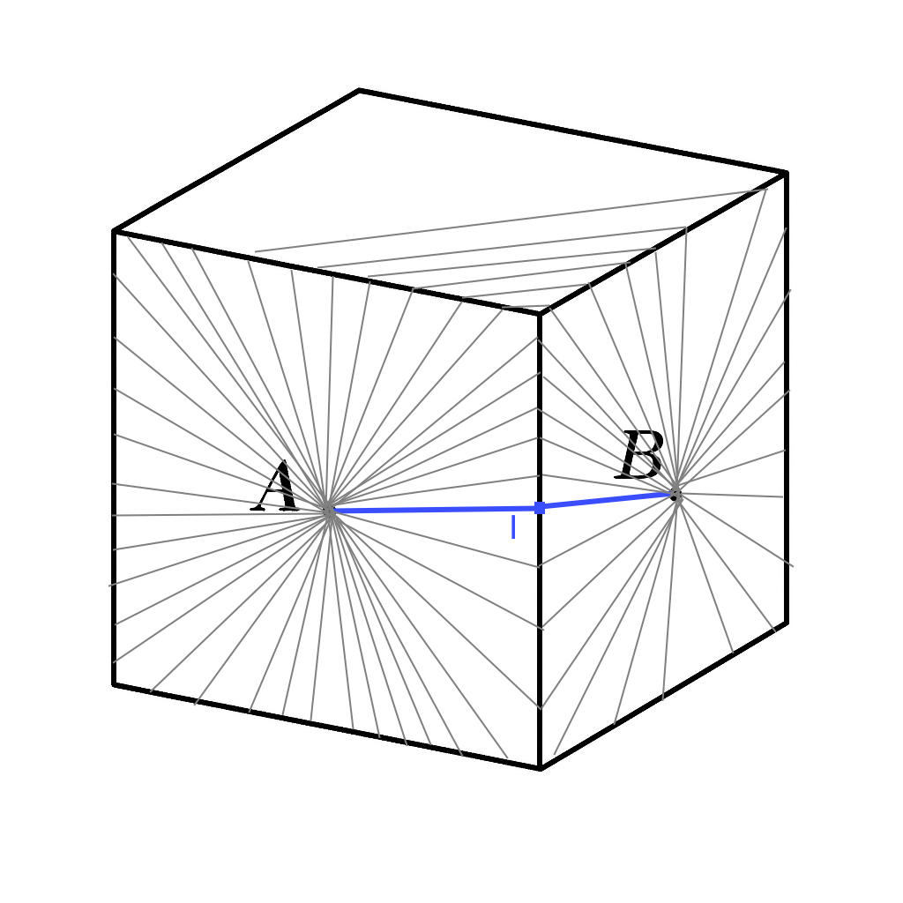 

On a placé I sur des coordonnées entières ce qui est évidemment une approximation : nous y reviendrons juste après.

 La distance (A,I) se calcul tres simplement car même face et le nombre de segments est très raisonnable.
 
  La distance(A,B) = AB est minimale avec AI + IB minimales.
  AI et IB etant en calcul direct il est facile de trouver AI + IB minimale
  ```python
 def meilleurs_points_communs(liste_A, liste_B, liste_adjacent, best):
  ```
  On trouve le meilleur I avec le code cas2 dans la fonction ci-dessus.

  Toutefois, il s’agit juste d’une approximation car la position de I n’est pas forcément aux coordonnées entières. 
  
  La vraie distance est entre I et I-1 ou entre I et I+1 (points prédécesseur ou successeur) en approches. L’estimation reprend de In-1 à In+1 et le segment est redécoupé, par pas de : 1/10 (paramètre réglable). 
  On sait que c'est autour du I précédent qui était notre meilleure approximation donc on redecoupe pour avoir le détail
  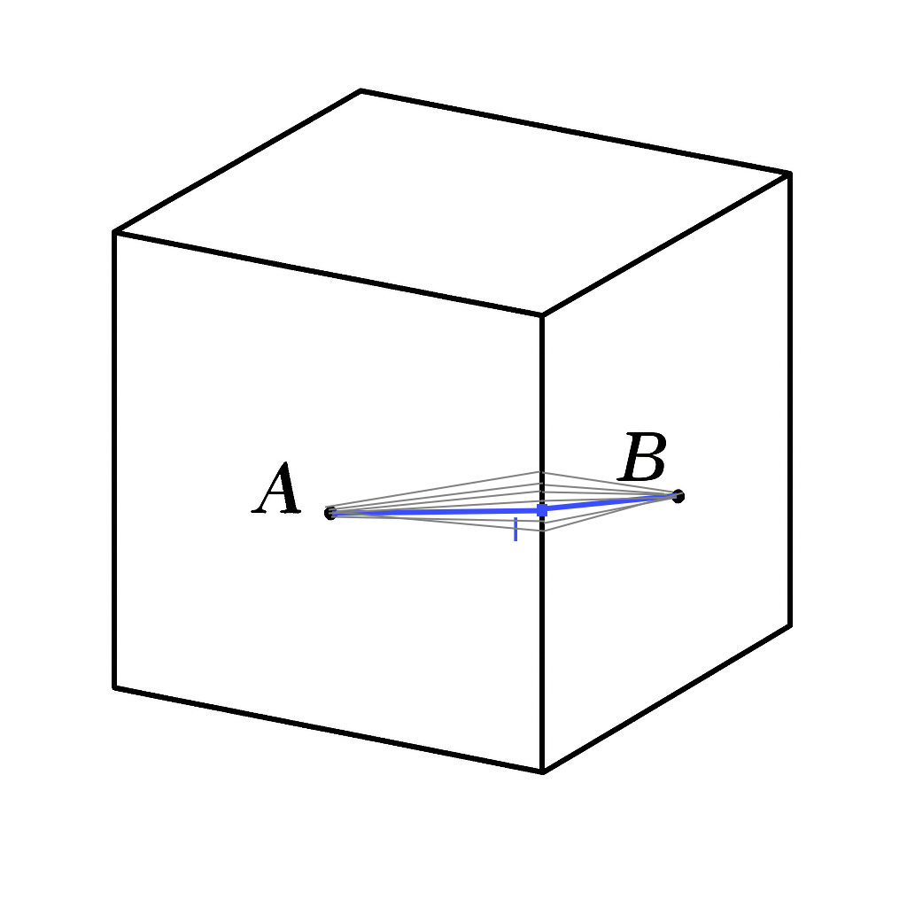 

La convergence est rapide au bout de quelques pas. L’approximation est liée à l’erreur d’angle entre A,B.
Si la récursion sur 10 pas ne suffit pas, il y a récursion sur 100 pas, avec les points I sur les bords de face. Mais 10 a suffi sur ce défi. 

comme on compare toujoiurs à best (la meilleure distance trouvé les cas s'éliminent très vite)

__Note sur le code :__ 

Seuls les points uniques sont gardés et les doublons enlevés. La méthode est sur X fixé, de varier Y ou Z ; si Y est fixé, de varier X ou Z, si Z est fixé, de varier X ou Y : la formule alternative est commune ; et une meilleure distance est retenue jusqu’à l’instant où un autre meilleur candidat est trouvé (libellé « best ») donc partant de B : il est testé IB < best et partant de A, AI < best. (AI +IB)^2=((sqrt(AI^2) +sqrt(IB^2)).

Si ce score de nouvelle distance est supérieur à best, la valeur n’est pas retenue et la distance doit être inférieure en valeur pour être retenue comme nouveau candidat en meilleur choix (nouveau point best).

Tous les candidats obtenus, sont triés par ordre croissant ; en retour le premier candidat de la liste triée.

## calcul cas3 : 
On garde le calcul du type cas2 comme une référence pour le "best" jusque la ce qui va éliminer beaucoup de calculs

On refait pareil mais avec deux points I1 sur la face de A et I2 sur la face de B


Le cas 2 avec un seul point I est traité avant le cas 3 ; car même en n’étant pas optimum, il reste un très bon candidat. Un deuxième point I2 est ajouté à un premier point I1 en passant par une autre face et on réitère le calcul de tous les points  I2 els que I2B < best en partant du point B ; en partant de A, le calcul est de tous les points I1 tels que AI1 < best puis : AI1 + I1I2 + I2B est calculé en devant demeurer < best.

Le cas 3 puis le cas 4 sont résolus à l’identique avec la plupart des tirages traités. Il reste le dernier cas 5.

## calcul cas 5
 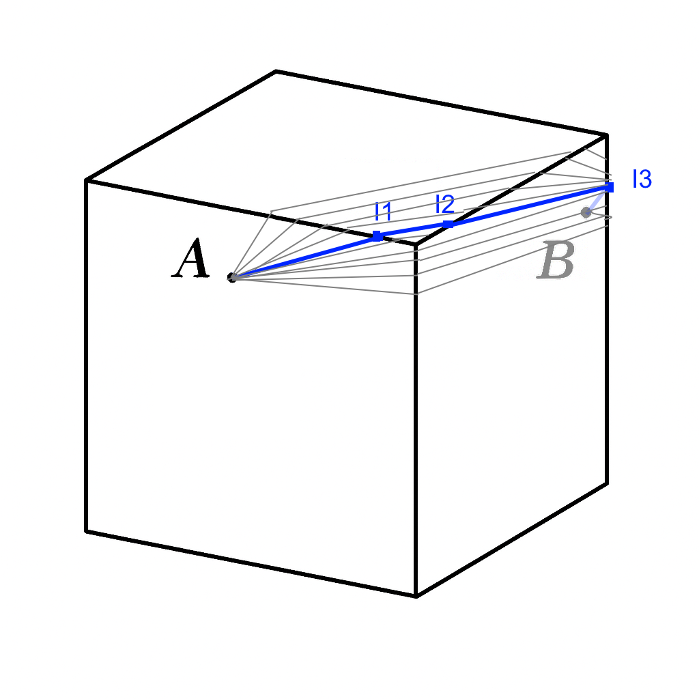 
Il faut considérer un nouveau point I3 et voir toutes les possibilités pour l’ensemble de points : I1, I2, I3.
I3B et AI1 ont déjà été calculé ; il n’y a pas le I2 au milieu ; considérons les segments qui relient la face A à la face B : les points I adjacents. Après plusieurs étapes, la distance a été établie pour AI1, due au cas 4.

Depuis B, I2 est sur la face commune avec I1 et I3 et n’étant pas placé au hasard, des cas sont éliminés.
De même, tous les candidats non potentiellement les meilleurs « best » sont éliminés à tous les niveaux.

Distance (A,B) = AB = (sqrt(AB^2)) = (sqrt(AI1^2)) + (sqrt(I1I2^2)) + (sqrt(I2I3^2)) +  (sqrt(I3IB^2))…

Très souvent, le calcul fait dépasser le candidat courant au score : pour conserver ce candidat en place.

Le nouveau candidat « best » est retenu. Après la connexion distante au netcat par : nc chall.fcsc.fr 2054, les coordonnées de Alice et Bob sont extraites en suites pour traiter vite par renvoi de réponse pour AB.

La réponse est renvoyée des coordonnées de A et de B et le calcul recommence jusqu’à cette remarque : « Congrats ! Here is the flag « : deux lignes à lire pour avoir la valeur du flag qui sinon, ne s’affiche pas ! 

La connexion au serveur s’interrompt : la ligne raccroche. Il y a 1000 réponses consécutives pour le flag.
Il est prérequis d’installer un environnement virtuel de compilation et le script PY s’exécute en 10 à 15’.


# Annexe
Le script associé: carre2.py permettait de confirmer jusqu’à l’exemple de l’énoncé contraint pour (A,B).

ce calcul utilisait des projections rotations de points des faces sur un cube aplati.

Il donne des résultats correct sur pas mal de cas mais devait y avoir une erreur car il n'a pu valider le flag. Pas eu le temps de le finaliser

le code est dans src/test_projections

 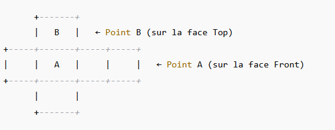

 Le flag est récupéré après l'éxécution.

  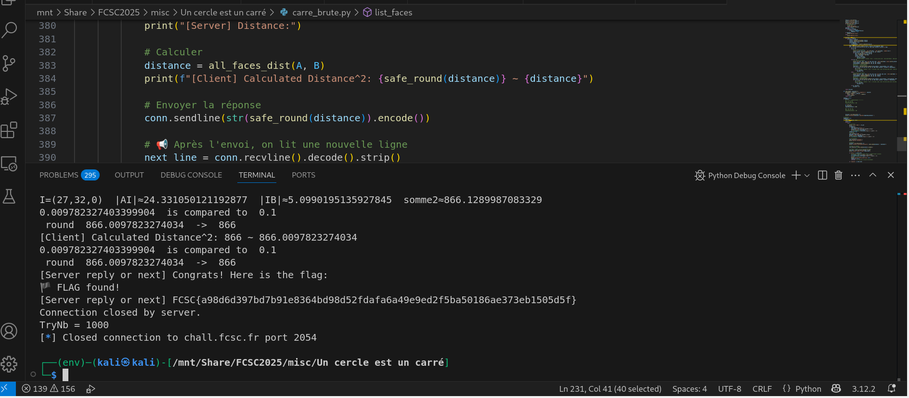

# Script : carre_brute

[Voir le code source](src/carre_brute.py)


